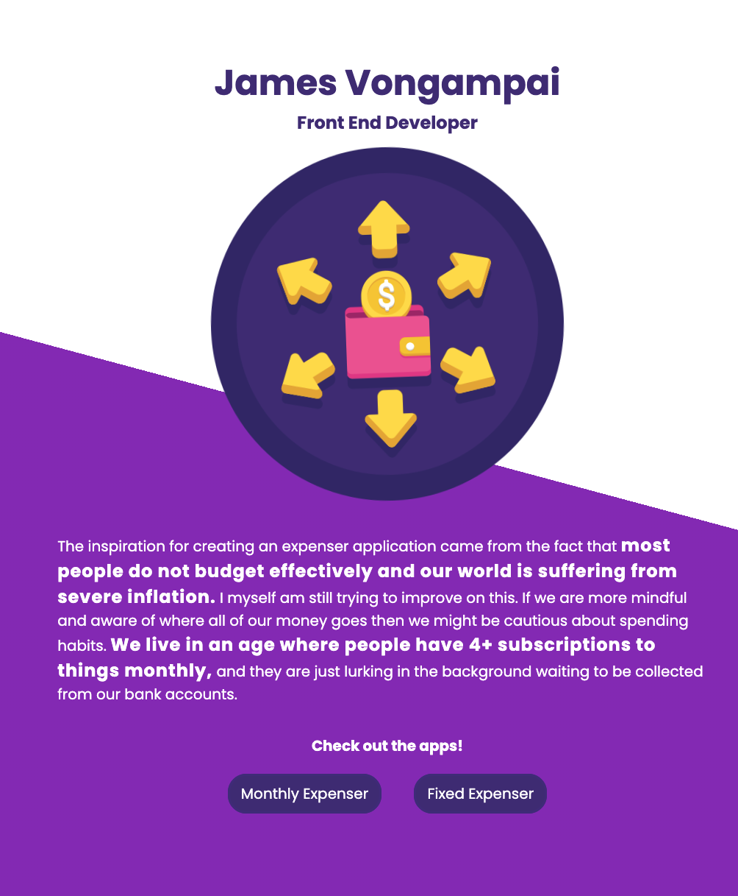
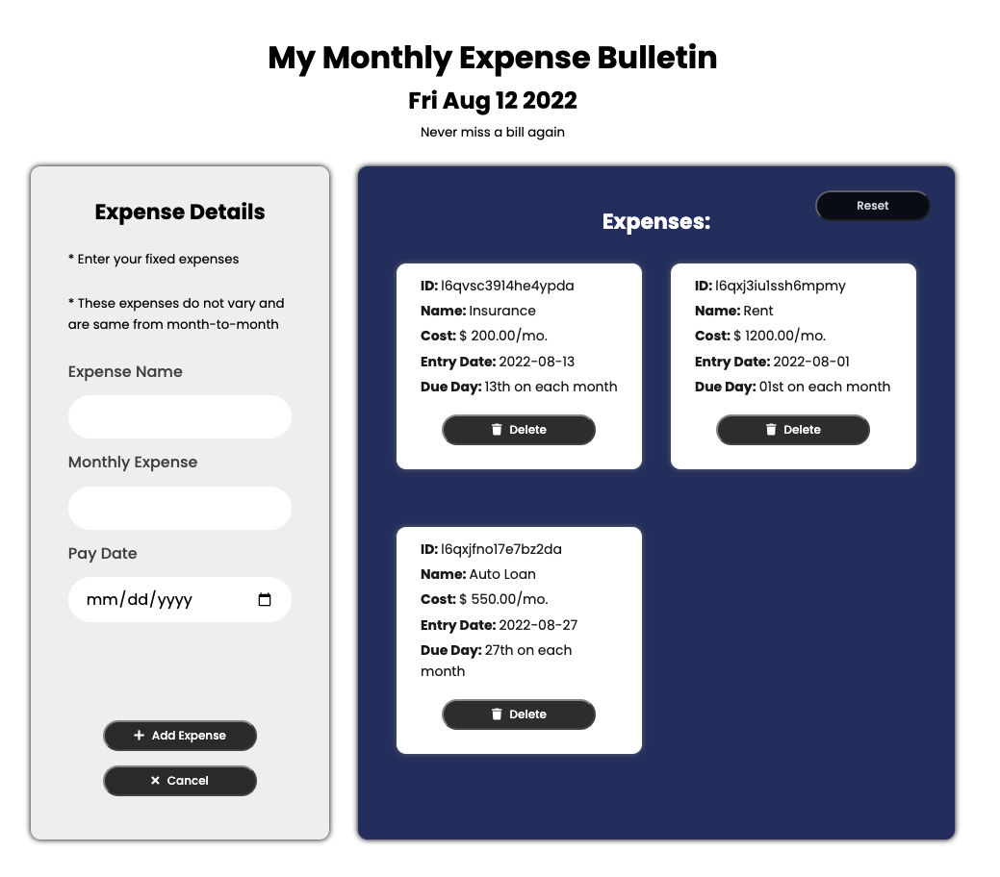
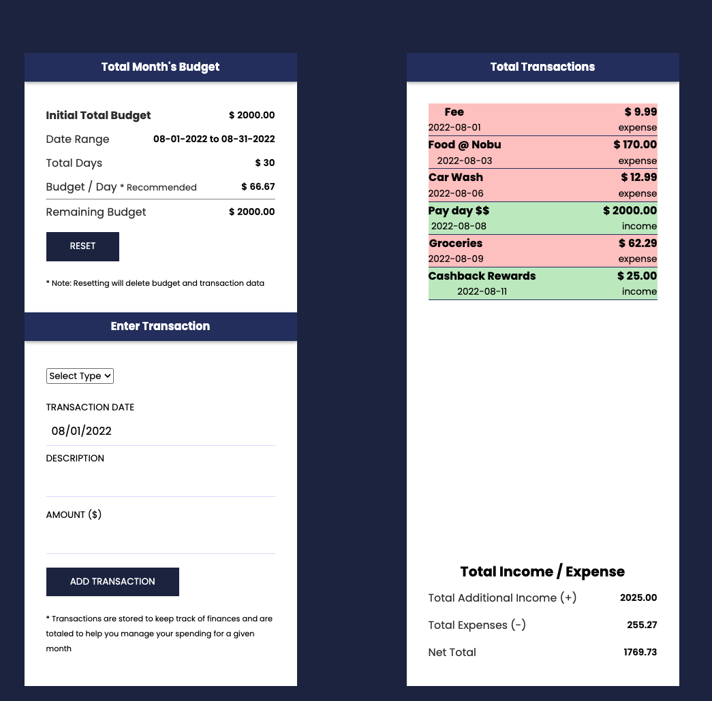

## The inspiration came from how subscriptions and mindless spending actually take a big chunk of our income.

[View App Here](https://jaythomasv29.github.io/expenser-app/about.html)

I learned that if you write all of your spendings down in a diary or weekly calendar, then you will be more cautious about spending and realize what is excess versus necessary.

----

### Monthly Expenser : A monthly expensing diary application that uses localStorage, user input, DOM manipulation, Date() Class and various functions

-------

### Fixed Expenser : A similar application but using to only track fixed expenses and a bulletin app to put all of your bill's due dates to make sure they are all accounted for

## Concepts I learned / implemented
- Javascript Classes
- JS Factory Functions to build classes / objects
- Event Listeners
- Callback functions
- Array methods
- `.map()`, `.filter()`, `.reduce()`
- Process User Input
- DOM methods, selectors, traversal
- Animations
- Conditional CSS styling
- CSS Pseudoclasses
- CSS Flexbox
- Github
- JS LocalStorage to persist data

